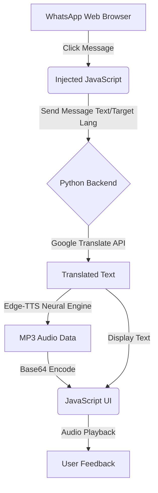

# ACADEMIC REPORT: WhatsApp AI Translator & TTS Assistant

**Author:** [Your Name]  
**Institution:** [Your Institution]  
**Date:** April 2026  
**Subject:** Human-Computer Interaction & Artificial Intelligence  

---

## Abstract

In the era of global connectivity, language remains a significant barrier to effective communication on instant messaging platforms. This report presents the design and implementation of a **Premium WhatsApp AI Translator & TTS Assistant**, a sophisticated tool that integrates real-time machine translation and neural text-to-speech (TTS) into the WhatsApp Web environment. By utilizing Selenium for automation, Google Translate for linguistic processing, and Microsoft's Edge-TTS for high-quality audio synthesis, the system provides a seamless, hands-free communication experience. The study focuses on UI/UX optimization through JavaScript injection and performance enhancements using asynchronous processing.

---

## Chapter 1: Introduction

### 1.1 Context
WhatsApp is the world's most popular messaging app, but it lacks native real-time translation for cross-lingual conversations. Users often switch between apps to translate messages, leading to "context switching" fatigue.

### 1.2 Motivation
The motivation behind this project is to create a "zero-effort" translation layer that lives directly within the browser, providing instant visual and auditory feedback.

---

## Chapter 2: Problem Statement & Objectives

### 2.1 Problem Statement
1. **Language Barrier**: Non-native speakers struggle with real-time text comprehension.
2. **Accessibility**: Visually impaired users or busy professionals need an auditory interface for incoming messages.
3. **Platform Limitations**: Browser-based instant messaging does not provide integrated AI tools for local dialects.

### 2.2 Objectives
- Develop a Python-based automation engine for WhatsApp Web.
- Inject a custom, interactive AI overlay for multi-language selection.
- Implement high-fidelity neural TTS for Marathi, Hindi, English, Tamil, and Telugu.
- Achieve sub-second polling latency for real-time responsiveness.

---

## Chapter 3: System Architecture

The system follows a hybrid architecture combining a Python backend with a JavaScript-injected frontend.

### 3.1 Technical Stack
- **Automation**: Selenium with Stealth Chrome configurations.
- **Translation**: `deep-translator` (Google Translate wrapper).
- **TTS**: `edge-tts` (Microsoft Neural voices).
- **UI**: Vanilla JS & CSS Injection.

---

## Chapter 4: Implementation Methodology

### 4.1 DOM Observation and Interaction
The system uses JavaScript click listeners attached to the root of the WhatsApp document. It identifies message containers via `data-testid='msg-container'` and extracts text content while filtering out metadata (timestamps, read receipts).

### 4.2 Translation Pipeline
Messages are sent from the browser to the Python script using a polling mechanism (`execute_script`). Python processes the request through the `GoogleTranslator` and generates audio concurrently using `asyncio`.

### 4.3 High-Quality Audio Synthesis
Unlike traditional browser `speechSynthesis`, which sounds robotic, this project uses **Edge-TTS** to generate human-like neural voices:
- `hi-IN-MadhurNeural` for Hindi.
- `mr-IN-ManoharNeural` for Marathi.
- `en-US-GuyNeural` for English.

---

## Chapter 5: Results & UI/UX Design

The UI is designed with a "Premium" aesthetic, featuring:
- **Glassmorphism-inspired** styling.
- **Dynamic Status Indicators**: Pulse animations for active processing.
- **Integrated Selectors**: Native-looking language dropdowns.

> [!TIP]
> The system implements "Turbo Polling" at 100ms intervals, ensuring that the translation appears almost instantly after a user clicks a message.

---

## Chapter 6: Conclusion & Future Scope

### 6.1 Conclusion
The WhatsApp AI Translator successfully bridges the gap between text-based messaging and multi-lingual accessibility. The use of neural TTS significantly improves user engagement compared to standard browser voices.

### 6.2 Future Scope
- **Multi-Browser Support**: Porting the engine to Firefox and Safari.
- **OCR Integration**: Translating text within images sent on WhatsApp.
- **Voice-to-Voice**: Enabling users to speak their replies for automated translation and transmission.

---

## References
1. Selenium Project Documentation. https://www.selenium.dev/
2. Microsoft Edge-TTS GitHub Repository.
3. Google Translate API via Deep-Translator.
4. "Modern Web UI Principles" - Interaction Design Foundation.
